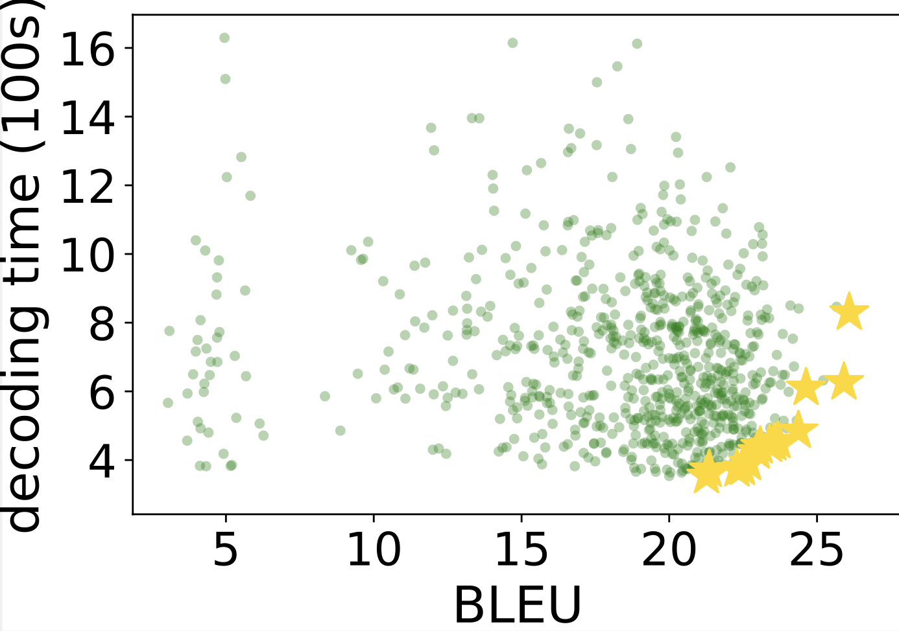
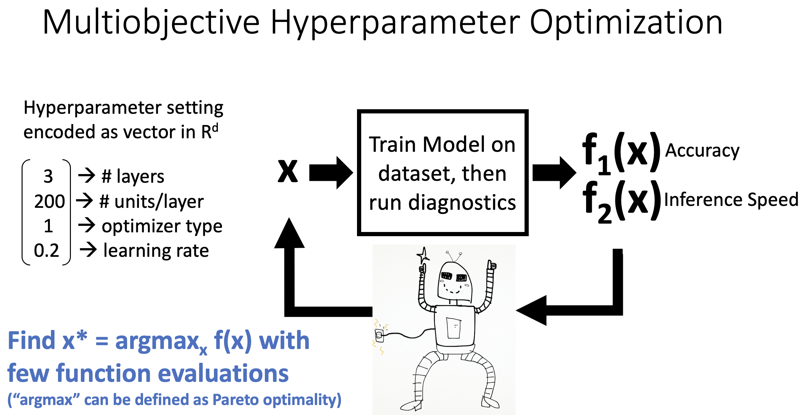

# AutoML 2022 Competition: Multi-objective Hyperparameter Optimization of Transformers

## Description

Hyperparameter optimization (HPO) is an important process in building neural networks with the right speed and accuracy characteristics.
This competition focuses on HPO of Transformer architectures, which are common in fields such as natural language processing, speech recognition, and computer vision.
Transformer hyperparameters like network depth, embedding dimension, number of heads, and subword units all interact with each other, and should be adapted to the target dataset for optimal speed-accuracy results.
Consider the speed-accuracy evaluation of machine translation systems in the scatterplot figure below.

<p></p>

Here, we plot 700 Transformer models (Vaswani, et. al., 2017), each trained on different hyperparameter settings, according to its decoding time on a GPU and its accuracy in terms of BLEU score on a standard machine translation (MT) benchmark. (BLEU score--higher the better--is a standard evaluation metric for machine translation. It compares the word subsequence overlap between system output and human reference.) 
Note that there is a large variance for both accuracy and speed: some models are very accurate, but slow. Others are fast but inaccurate. Ideally we desire models on the Pareto frontier, which are at the lower-right of the plot and deemed optimal in terms of accuracy-speed tradeoffs.
Our ultimate goal is to invent hyperparameter optimization methods that will find these Pareto models automatically and efficiently, without resorting to expensive grid search.

We will view HPO as an iterative blackbox optimization problem. 
Each hyperparameter configuration is encoded as an input feature vector <b>x</b>, and the associated speed/accuracy metrics of a model trained with this hyperparameter is the output <b>f(x)</b>. 
 Whenever we try sampling a new value of <b>x</b>, we can observe the associated <b>f(x)</b>. After collecting a set of these (<b>x</b>,<b>f(x)</b>) pairs, we can treat this as a meta machine learning problem.
 In other words, we can build a predictor that tries to find the <b>x</b> which will give the best <b>f(x)</b>. Methods such as Bayesian Optimization and Evolutionary Strategies are common. 
 Since obtaining <b>f(x)</b> is an expensive process that requires training a Transformer model, we would like to find the best hyperparameter settings with as few samples of (<b>x</b>,<b>f(x)</b>) as possible. 
 The figure below illustrates this problem definition.
    


In this competition, we will be comparing HPO methods using a "table lookup" approach, which results in reproducible research and smaller barrier to entry. This approach was recently introduced to neural architecture search (Ying et. al., 2019) and HPO (Klein and Hutter, 2019).
First, as competition organizers, we train an extremely large number of Transformer models with diverse hyperparameter settings and record their performance metrics (e.g. BLEU, decoding time) in a table. We publish this table to the participants. 
Then, participants will constrain their hyperparameter optimization methods to sample from this finite set of models. This allows them to simply ``look-up" their pre-computed performance metrics, and amortizes the burden of computation: as long as we ensure that we have trained and pre-computed a large number of representative models beforehand, hyperparameter optimization algorithm developers no longer need to deal with the cost of training the models themselves.

The participant will train and develop their code for hyperparameter optimization on the public MT datasets in this repository. 
Then the participant will submit code to be tested on a new MT dataset (different language for MT and different GPU used to measure decoding time, but same hyperparameter space and same Transformer training pipeline.) 
We will allow participants to explore HPO Transfer Learning methods, meaning that data from the six public MT datasets here can be exploited for improving HPO on the new test MT dataset. 
HPO method will be evaluated in terms of number of Pareto solutions obtained under a fixed budget of table lookups (budget is set 200 samples). The HPO method that discovers the highest number of Pareto solutions wins.

## Local Run

To run locally, first clone this repo.
Then go to the starter kit and follow its [README.md](starting_kit/README.md):

```
git clone https://github.com/Este1le/hpo_nmt.git
cd hpo_nmt/automl2022/starting_kit
```

## Codalab Code Submission

The local run setup mirrors the Codalab code submission setup.
So please see the same [README.md](starting_kit/README.md). 


## Timeline

- April 5: Development phase starts. Codalab leaderboard and public data release.
- June 15: Evaluation phase starts. Code submitted in development phase will be automatically tested on new data.
- June 25: Evaluation results announced. 
- July 25-27, 2022: <a href="https://automl.cc">AutoML Conference</a>. Winning participants are invited to present their work. 


## References 

- For an overview of the HPO problem, Pareto optimality, and the tabular benchmark framework, refer to our <a href="https://slideslive.com/38970663/benchmarks-for-multiobjective-hyperparameter-optimization">NeurIPS workshop invited talk</a>
- For details about the dataset and metrics, refer to our <a href="https://www.cs.jhu.edu/~kevinduh/papers/zhang20benchmark.pdf">TACL paper</a>: Zhang and Duh (2020), Reproducible and Efficient Benchmarks for Hyperparameter Optimization of Neural Machine Translation Systems
- The dataset can be downloaded from <a href="https://github.com/Este1le/hpo_nmt">github</a>.
