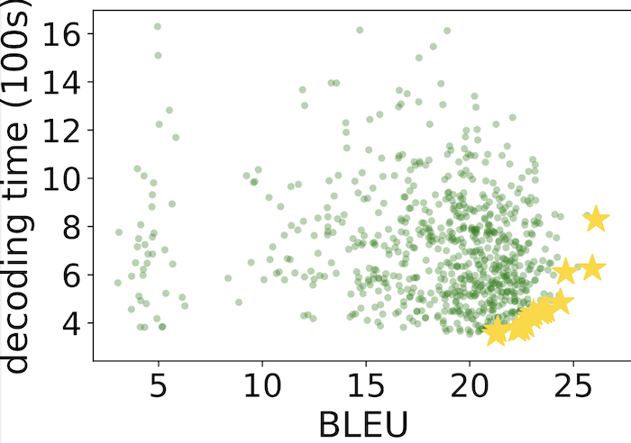

# AutoML 2022 Competition: Multi-objective Hyperparameter Optimization of Transformers

## Description

The speed, size, and accuracy of deep neural networks often depend on hyperparameters such as network depth and architecture type.
Many hyperparameter optimization methods have been proposed to date, including Bayesian Optimization, Evolutionary Strategy, Hyperband, and Random Forests.
Consider the speed-accuracy evaluation of machine translation systems in the scatterplot figure below.



Here, we plot 700 Transformer models (Vaswani, et. al., 2017), each trained on different hyperparameter settings, according to its decoding time on a GPU and its accuracy in terms of BLEU score on a standard machine translation (MT) benchmark. (BLEU score--higher the better--is a standard evaluation metric for machine translation. It compares the word subsequence overlap between system output and human reference.) 
Note that there is a large variance for both accuracy and speed: some models are very accurate, but slow. Others are fast but inaccurate. Ideally we desire models on the Pareto frontier, which are at the lower-right of the plot and deemed optimal in terms of accuracy-speed tradeoffs.
Our ultimate goal is to invent hyperparameter optimization methods that will find these Pareto models automatically and efficiently, without resorting to expensive grid search.

One way to formulate hyperparameter optimization (HPO) is as a black-box problem: First, assume we have a class of models, indexed by hyperparameters $\bm{\lambda} \in \Lambda$. Second, assume that we can instantiate a model, train it, and then measure its accuracy as $f^1(\bm{\lambda})$ and speed as $f^2(\bm{\lambda})$. For a single-objective problem, our goal would be to find $\arg\max_{\lambda^\prime \in \Lambda} f^1(\bm{\lambda^\prime})$; for multi-objective problems, our goal is to find $PARETO_{\lambda^\prime \in \Lambda} \left[ f^1(\bm{\lambda^\prime}), f^2(\bm{\lambda^\prime})\right]$. Since the space of hyperparameters $\Lambda$ is potentially infinite, the goal is to approach the optima with as few function evaluations as possible. 

We will be comparing HPO methods using a "table lookup" approach, which results in reproducible research and smaller barrier to entry. This approach was recently introduced to neural architecture search (Ying et. al., 2019) and HPO (Klein and Hutter, 2019).
First, as competition organizers, we train an extremely large number of Transformer models with diverse hyperparameter settings and record their performance metrics (e.g. BLEU, decoding time) in a table. We publish this table to the participants. 
Then, participants will constrain their hyperparameter optimization methods to sample from this finite set of models. This allows them to simply ``look-up" their pre-computed performance metrics, and amortizes the burden of computation: as long as we ensure that we have trained and pre-computed a large number of representative models beforehand, hyperparameter optimization algorithm developers no longer need to deal with the cost of training the models themselves.

The participant will train and develop their code for hyperparameter optimization on the six public MT datasets in this repository. Then the participant will submit code to be tested on a new MT dataset (different language for MT and different GPU used to measure decoding time, but same hyperparameter space and same Transformer training pipeline.) We will allow participants to explore HPO Transfer Learning methods, meaning that data from the six public MT datasets here can be exploited for improving HPO on the new test MT dataset. HPO method will be evaluated in terms of number of Pareto solutions obtained under a fixed budget table lookups (see the metric "fixed-budget (fb)" in the associated <a href="https://www.cs.jhu.edu/~kevinduh/papers/zhang20benchmark.pdf">paper</a>). 

## Local Run

To run locally, first clone this repo.
Then go to the starter kit and follow its [README.md](starting_kit/README.md):

```
git clone https://github.com/Este1le/hpo_nmt.git
cd hpo_nmt/automl2022/starting_kit
```

## Codalab Code Submission

TODO


